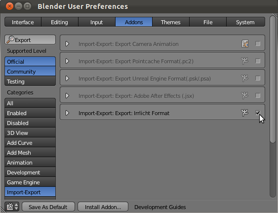

Installation
============

.. toctree::
   :maxdepth: 2

The latest stable download of irrb is accessible from both the "Project Home" and "Downloads" tabs of the Tubras Google Code project. On the "Project Home" tab, irrb is listed in the "Featured Downloads" section. 

The current version is 0.6. It may be downloaded from here: 
http://tubras.googlecode.com/files/irrb-0.6.zip 

The contents of the zip package are: 

* io_export_irrlicht.py
* docs/changes.txt
* docs/license.html
* docs/UserGuide.pdf

To install irrb, unzip the contents of the zip file into a temporary directory and install it as a Blender **addon**.

1. Start Blender and call up the **User Preferences** dialog (File | User Preferences..).  
2. Click on the **Add-Ons** tab and the the **Install Add-On...** button located at the bottom of the dialog.
3. Navigate to the directory that you previously unzipped the irrb zip file to, select the file **io_export_irrlicht.py**, and then click the **Install Add-On...** button. 
4. Locate the irrb exporter in the **Import-Export** section and enable it by selecting the check box. 

If you would like irrb to be automatically activated every time you start Blender, then click the **Save As Default** button located at the bottom of the dialog. If you don't click **Save As Default**, you will need activate the irrb add-on each time you start up Blender. 

Documentation on installing and configuring "iwalktest" for both Windows and Linux may be found here: irrb Utilities 

Requirements
------------
* Blender - Supported Blender Versions are 2.56+
* Python - irrb uses Blender's internal version of Python 3.x so you are not required to install Python.

