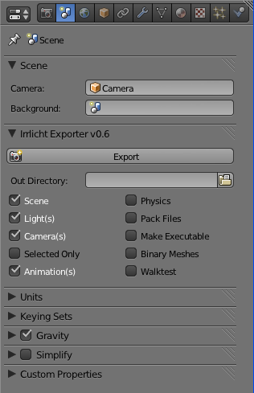

Export Panel
============

.. toctree::
   :maxdepth: 2

The Export panel is used to control what is exported along with the location of
where to generate the exported output.  If you have installed and configured
the irrb utilities, you may also choose to optionally walktest your exported
scene.

.. Note::
   All of the output (texture, mesh, & scene files) generated by **irrb**
   will be written relative to the output location defined "**Out
   Directory**". By default:

   * The **Scene** file (.irr) is saved to the output directory -
     "{out}/{scene name}.irr".
   * **Texture** files are written to a sub-directory named "tex" - "{out}/tex/".
   * **Mesh** files are written to to a sub-directory named "mdl" -
     "{out}/mdl/".

   All file references in the generated scene and mesh files are relative as well.  This allows scenes to be loaded from arbritray locations as long as the base and relative sub-directories remain intact.

   It is also worth noting that the default "mdl/" and "tex/" sub-directories used
   for storing mesh and texture files, may be customized in irrb's
   configuration file.

Depending on the Export option(s) you select, additional options may or may
not appear.  For example, selecting the "Walktest" option will cause
walktest related options to appear.

Basic Export Options
^^^^^^^^^^^^^^^^^^^^

**Scene** - Check box used to control whether or not a scene file (".irr") is generated. If checked, an Irrlicht scene file is written to the chosen output directory.  The generated scene file name is based on the active Blender scene name: "{out}/{Blender scene name}.irr".  Therefore, if the scene being exported is named "TestLevel", the generated scene file would be "{out}/TestLevel.irr".

**Light(s)** - Check box used to indicate whether or not light objects are written to the Irrlicht scene file. 

**Camera(s)** - Check box used to indicate whether or not camera objects are written to the Irrlicht scene file. 

**Selected Only** - Check box used to export only **objects** that are selected in the current scene. When un-selected, all objects in Blender's visible layers will be exported. 

**Animations** - not implemented.

**Physics** - Check box used to indicate whether or not to write collision/physics to the Irrlicht scene file. When selected, additional physics related options will appear.

**Pack Files**

**Make Executable**

**Binary Meshes**

**Walktest**
Create Binary Meshes - This toggle button will only appear if you have the imeshcvt utility installed and properly configured. When selected, the meshes will be exported using the experimental ".irrbmesh" (binary .irrmesh) format. imeshcvt is the program used to convert from .irrmesh to .irrbmesh. The original .irrmesh files are left intact. For more information on the .irrbmesh format, see the section named "Binary Mesh Format". 

Export Camera(s) - Toggle button to indicate whether or not to write camera objects to the ".irr" scene file. 

Export Physics – Toggle button to indicate whether or not to include collision/physics data in the ".irr" scene file.

Walk Test – This toggle button that will appear if you have the IWALKTEST OS environment variable defined. When selected, the program defined by the IWALKTEST environment variable is executed with your exported scene file as parameter immediately after a successful export. The "irrb Utilities" contains a program that you may use to examine an exported scene.

Create irrb Properties – This push button creates "irrb" default ID Properties for selected objects and Blender materials.  When clicked, the "Status" area will display information on the number of objects that were updated.  For more information on creating "irrb" ID Properties, see the section named: ID Properties.

Irrlicht Version – This experimental option allows you to select the target Irrlicht version for binary meshes. It will only appear if the "Create Binary Meshes" option is selected. 

Export - Makes the magic happen. 

Run Walk Test - Button that re-runs the iwalktest application with the last scene exported. 

Exit - Exits the irrb export script. 

