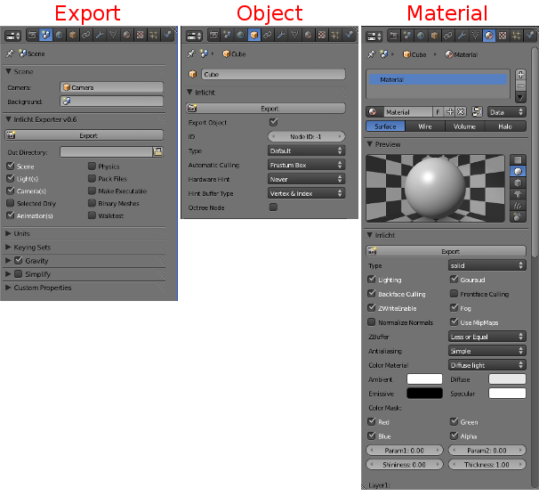

==================
Interface Overview
==================

.. toctree::
   :maxdepth: 2

The **irrB** interface includes three Blender addon property panels.
These panels allow you to control Irrlicht specific properties 
when exporting scene objects and materials.

.. note::

	Each **irrB** custom panel contains an "Export" button which allows you to quickly 
	export without having to switch to the export panel when making adjustments in 
	either the object or material panels.
	  

:doc:`Export Panel </export_panel>`

The **export** property panel is located in the Blender's **Scene** properties panel group. 
This panel allows you to set export specific options and choose whether or not to walktest
your scene after exporting.  

:doc:`Object Panel </object_panel>`

The **object** property panel is located in the Blender's **Object** properties panel group.  
This panel allows you to set an object's scene node ID, the object type, and type
dependent properties.

:doc:`Material Panel </material_panel>`

The **material** property panel is located in Blender's **Material** properties panel group.
This panel allows you to set every Irrlicht `SMaterial <http://irrlicht.sourceforge.net/docu/classirr_1_1video_1_1_s_material.html>`_ property from within
Blender.  

