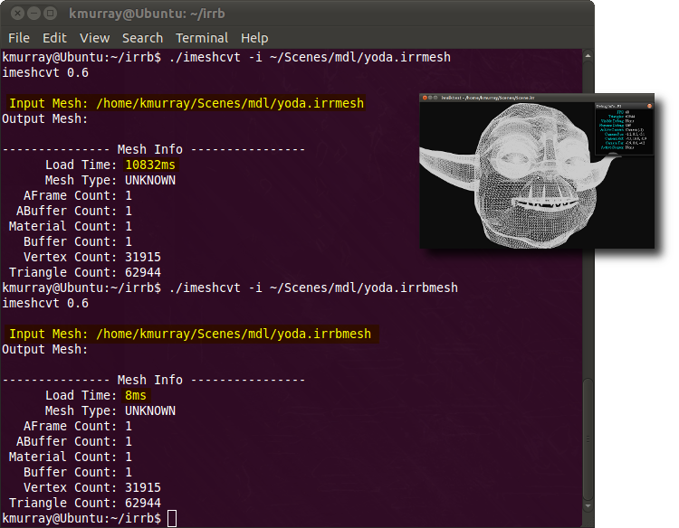

==================
Binary Mesh Format
==================
.. highlight:: cpp
   :linenothreshold: 5

.. toctree::
   :maxdepth: 2

.. note::
 
	* The binary mesh format is currently **experimental and subject to change**.
	* irrbmesh files (binary mesh) load into your application very quickly. 
	* The code to read/write the .irrbmesh format is freely available to you 
	  under the same license as Irrlicht.
	   
The experimental .irrbmesh binary mesh format is fast loading. Irrlicht's native 
.irrmesh format is based on XML and all though it's nice for exchanging mesh 
information, it can be painfully slow to load especially for larger scenes and 
meshes. The following screen shot displays the load times for a high-poly **yoda** 
mesh exported as .irrmesh and .irrbmesh:
    

The respective files sizes and load times are: 

	* yoda.irrmesh - 3,481,399 bytes loaded in 10.8 seconds. 
	* yoda.irrbmesh - 2,925,831 bytes loaded in 8 milli-seconds.
	 
The yoda mesh contains approximately 60k faces in a single mesh buffer. The main 
reason the .irrbmesh format performs so well is that it mimics Irrlicht's 
internal mesh buffer and material formats. Very little parsing is required.  

Using .irrbmesh In Your Application
===================================
 
It is relatively easy to enable your application(s) to read and write .irrbmesh 
files. Simply save the following files to your applications source directory: 

	* `CIrrBMeshFileLoader.h  <http://tubras.googlecode.com/svn/trunk/tools/irrlicht/extensions/CIrrBMeshFileLoader.h>`_
	* `CIrrBMeshFileLoader.cpp <http://tubras.googlecode.com/svn/trunk/tools/irrlicht/extensions/CIrrBMeshFileLoader.cpp>`_
	* `CIrrBMeshWriter.h <http://tubras.googlecode.com/svn/trunk/tools/irrlicht/extensions/CIrrBMeshWriter.h>`_
	* `CIrrBMeshWriter.cpp <http://tubras.googlecode.com/svn/trunk/tools/irrlicht/extensions/CIrrBMeshWriter.cpp>`_
 
To read .irrbmesh files::

	// define _IRR_COMPILE_WITH_IRRB_MESH_LOADER_ to compile the loader
	// loader depends on writers header
	#include "CIrrBMeshWriter.h"
	#include "CIrrBMeshLoader.h"
	// initialization code for loading .irrbmesh files
	//
	// ISceneManager* sceneManager	- previously initialized.
	// IfileSystem*	fileSystem    	- previously initialized.
	CIrrBMeshFileLoader* loader = new CIrrBMeshFileLoader(sceneManager, fileSystem);
	sceneManager->addExternalMeshLoader(loader);
	loader->drop();

	// after initialization, any irrbmesh file may be read via:
	IAnimatedMesh* pmesh = sceneManager->getMesh("mymesh.irrbmesh");

To write .irrbmesh files::

	#include "CIrrBMeshWriter.h"
	// initialization code for loading .irrbmesh files
	//
	// IvideoDriver*	videoDriver	- previously initialized.
	// IfileSystem*	fileSystem	- previously initialized.
	// IMesh* 		mesh		- previously initialized.
	IMeshWriter* writer = new CIrrBMeshWriter(m_videoDriver,m_fileSystem);
	((CIrrBMeshWriter*)writer)->setVersion(0x0106);	  - Irrlicht version target
	((CirrbMeshWRiter*)writer)->setCreator("myapp"); - Creator

	// after initialization, any mesh may be saved as an irrbmesh file via:
	IWriteFile* file;
	file = fileSystem->createAndWriteFile("test.irrbmesh");
	writer->writeMesh(file, mesh);

